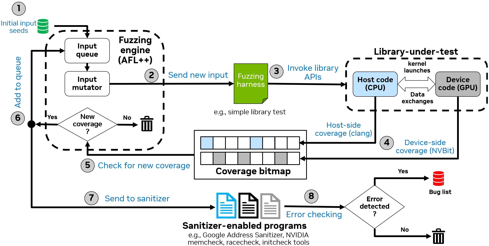
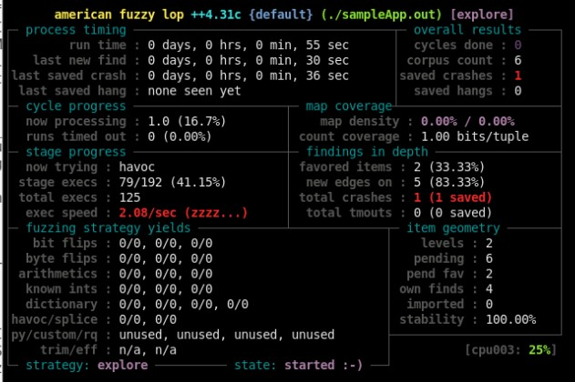
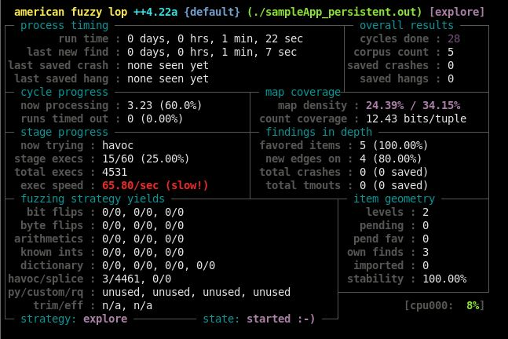

# cuFuzz / cuFuzzNN

This repository contains the artifacts for **cuFuzz**, a GPU-oriented coverage-guided fuzzer for userland CUDA applications. cuFuzz combines host-side and device-side coverage collection with sanitization to effectively discover bugs in CUDA programs.

## cuFuzzNN Extension (This Branch)

This branch (`cuFuzzNN`) extends cuFuzz with **floating-point anomaly detection** capabilities inspired by [nixnan](https://github.com/parfloat/nixnan). In addition to coverage-guided fuzzing, cuFuzzNN detects:

- **NaN (Not-a-Number)** values produced by FP operations
- **Infinity (±∞)** values from overflow or division by zero
- **Subnormal (denormalized)** values indicating precision loss

This enables discovery of numerical stability bugs in CUDA applications that may not cause crashes but produce incorrect results.



## Repository Structure

```
cufuzz-artifacts/
├── src/                        # Core cuFuzz components
│   ├── cufuzz_cov_nvbit/       # NVBit-based device-side coverage + FP anomaly detection
│   │   ├── cufuzz_cov.cu       # Main instrumentation tool (coverage + FP detection)
│   │   ├── inject_funcs.cu     # Device-side instrumentation functions
│   │   ├── fp_common.h         # FP anomaly data structures and classification
│   │   └── Makefile
│   └── cufuzz_sand/            # Sanitizer wrappers for SAND integration
├── targets/                    # Example fuzzing targets
│   └── sampleApp/              # Simple CUDA app with intentional bug for testing
│       └── fp_test.cu          # FP anomaly test (NaN/Inf generation)
├── scripts/                    # Evaluation and analysis scripts
├── Tools/                      # External dependencies
│   ├── AFLplusplus/            # AFL++ fuzzer (git submodule)
│   └── AFLplusplus.patch       # cuFuzz patches for AFL++
├── third-party-licenses/       # Third-party license files
│   ├── LICENSE_from_aflplusplus  # AFL++ Apache 2.0 license
│   └── LICENSE_from_nvbit        # NVBit NVIDIA EULA
├── images/                     # Documentation images
├── build.sh                    # Automated build script
├── verify_build.sh             # Quick verification test
├── Dockerfile                  # Docker container definition
├── LICENSE                     # Apache License 2.0
└── CONTRIBUTING.md             # Contribution guidelines and DCO
```

## Requirements

### Hardware Requirements

cuFuzz was tested on the following hardware configuration:

| Component | Specification |
|-----------|---------------|
| **GPU** | NVIDIA A40 (48GB VRAM, Compute Capability 8.6) |
| **CPU** | Intel Xeon Platinum 8362 (64 cores, 2 threads/core) |
| **Memory** | 120GB+ RAM recommended |
| **Storage** | 50GB+ free space for Docker image and fuzzing outputs |

**Other GPUs**: cuFuzz should work on other NVIDIA GPUs with Compute Capability ≥ 7.0. Adjust the `GPU_ARCH` environment variable accordingly (see [GPU Architecture Configuration](#gpu-architecture-configuration)).

### Software Requirements

| Component | Version |
|-----------|---------|
| Ubuntu | 22.04 LTS |
| NVIDIA Driver | 570.144 or compatible |
| CUDA Toolkit | 12.9 |
| Docker | 20.10+ (recommended) |
| nvidia-container-toolkit | Required for `--gpus` flag support |
| clang | 14 |

## Quick Start: Docker Instructions

The fastest way to try cuFuzz is to use a Docker container. Our Dockerfile uses the official NVIDIA CUDA 12.9 development image.

### 1. Extract the Artifact and Set Up AFL++

```bash
tar -xzvf cufuzz-artifacts.tar.gz
cd cufuzz-artifacts

# Clone AFL++ (required dependency)
git clone https://github.com/AFLplusplus/AFLplusplus.git Tools/AFLplusplus
cd Tools/AFLplusplus
git checkout 9cac7ced05eb9f36c1d0b02ad594b3b09cd3938b
cd ../..
```

### 2. Build Docker Image

Build the Docker image, specifying your GPU architecture:

```bash
sudo docker build --build-arg GPU_ARCH=<your_arch> -t cufuzz .
```

**GPU architecture reference:**

| GPU Family | Architecture | Examples |
|------------|--------------|----------|
| Ampere (Data Center) | `sm_80` | A100|
| Ampere (Consumer/Pro) | `sm_86` | A40, RTX 3090, RTX 3060 |
| Hopper | `sm_90` | H100 |
| Ada Lovelace | `sm_89` | RTX 4090, L40 |
| Turing | `sm_75` | RTX 2080, T4 |

For a complete list, see: https://developer.nvidia.com/cuda-gpus

Example for A40/RTX 3090:
```bash
sudo docker build --build-arg GPU_ARCH=sm_86 -t cufuzz .
```

> **Note**: This step may take several minutes depending on your machine and network connection.

### 3. Run Docker Container

```bash
sudo docker run --rm --gpus all -it -v /:/my_workspace cufuzz bash
```

### 4. Verify Installation

Once the Docker container is running, verify the build:

```bash
root@container:~/cufuzz# ./verify_build.sh
```

## Detailed Build Instructions (Without Docker)

### Prerequisites

Install the required dependencies on Ubuntu 22.04:

```bash
apt-get update && apt-get install -y build-essential python3-dev automake cmake git flex \
    bison libglib2.0-dev libpixman-1-dev python3-setuptools cargo libgtk-3-dev lld llvm llvm-dev \
    clang ninja-build cpio libcapstone-dev wget curl python3-pip vim less libxxhash-dev bc zlib1g-dev
```

### Set GPU Architecture

Set the `GPU_ARCH` environment variable for your GPU (see architecture table above):

```bash
export GPU_ARCH=sm_86  # Change to match your GPU
```

### Build AFL++

```bash
cd Tools/AFLplusplus 
patch -N -p1 < ../AFLplusplus.patch 
export CXX=/usr/bin/clang++-14 
export CC=/usr/bin/clang-14
make -j8 &> build.log
```

### Build NVBit Coverage Tool

Download NVBit version 1.7.5:
```bash
mkdir -p Tools/NVBit
wget https://github.com/NVlabs/NVBit/releases/download/v1.7.5/nvbit-Linux-x86_64-1.7.5.tar.bz2
tar -xvf nvbit-Linux-x86_64-1.7.5.tar.bz2 
mv nvbit_release_x86_64/* Tools/NVBit/
rm -rf nvbit_release_x86_64 nvbit-Linux-x86_64-1.7.5.tar.bz2
```

Build our NVBit coverage tool:
```bash
cd src/cufuzz_cov_nvbit/
export GPU_ARCH=sm_86  # Adjust for your GPU
ARCH=$GPU_ARCH make 
```

### Build Sanitizer Wrappers

```bash
cd src/cufuzz_sand
AFL_SAN_NO_INST=1 ../../Tools/AFLplusplus/afl-clang-fast -O2 wrapper_san.c -o wrapper_memcheck.out 
AFL_SAN_NO_INST=1 ../../Tools/AFLplusplus/afl-clang-fast -DSAN_MODE_INIT -O2 wrapper_san.c -o wrapper_initcheck.out 
AFL_SAN_NO_INST=1 ../../Tools/AFLplusplus/afl-clang-fast -DSAN_MODE_RACE -O2 wrapper_san.c -o wrapper_racecheck.out
AFL_SAN_NO_INST=1 ../../Tools/AFLplusplus/afl-clang-fast -DSAN_MODE_ASAN -O2 wrapper_san.c -o wrapper_asan.out
```

## Usage

After building cuFuzz, invoke fuzzing using the following command:

```bash
CUFUZZ_MAP_SIZE=65536 AFL_SKIP_CPUFREQ=1 AFL_PRELOAD=/PATH/TO/cufuzz_cov.so \
    ./Tools/AFLplusplus/afl-fuzz -x sample.dict -i input_samples/ -o output_dir/ \
    -t 1000000 ./cuda_app.out @@
```

### cuFuzz Environment Variables

#### AFL++ Standard Variables

| Variable | Description | Example |
|----------|-------------|---------|
| `AFL_SKIP_CPUFREQ` | Skip CPU scaling policy check | `AFL_SKIP_CPUFREQ=1` |
| `AFL_PRELOAD` | Path to NVBit coverage tool | `AFL_PRELOAD=/path/to/cufuzz_cov.so` |

#### cuFuzz Coverage Variables

| Variable | Description | Example |
|----------|-------------|---------|
| `CUFUZZ_MAP_SIZE` | Coverage map size in bytes | `CUFUZZ_MAP_SIZE=65536` |
| `COV_PERSISTENT` | Enable AFL persistent mode support (0=no, 1=yes) | `COV_PERSISTENT=1` |
| `GPU_ARCH` | Target GPU architecture for builds | `GPU_ARCH=sm_86` |

#### cuFuzzNN FP Anomaly Detection Variables

| Variable | Description | Default |
|----------|-------------|---------|
| `FP_DETECT` | Enable FP anomaly detection (0=no, 1=yes) | `0` |
| `FP_DETECT_NAN` | Detect NaN values (0=no, 1=yes) | `1` |
| `FP_DETECT_INF` | Detect Infinity values (0=no, 1=yes) | `1` |
| `FP_DETECT_SUBNORM` | Detect subnormal values (0=no, 1=yes) | `0` |
| `FP_VERBOSE` | Print each anomaly as detected (0=no, 1=yes) | `0` |

#### cuFuzz Sanitization Variables

| Variable | Description | Example |
|----------|-------------|---------|
| `ORIGINAL_APP` | Path to vanilla (uninstrumented) application | `ORIGINAL_APP=./cuda_app` |
| `SANITIZER_PATH` | Path to compute-sanitizer binary | `SANITIZER_PATH=/usr/local/cuda/bin/compute-sanitizer` |
| `SANITIZER_ARG` | Arguments for memcheck sanitizer | `SANITIZER_ARG="--tool=memcheck --error-exitcode 99"` |
| `SANITIZER_ARG_RACE` | Arguments for racecheck sanitizer | `SANITIZER_ARG_RACE="--tool=racecheck --error-exitcode 99"` |
| `SANITIZER_ARG_INIT` | Arguments for initcheck sanitizer | `SANITIZER_ARG_INIT="--tool=initcheck --error-exitcode 99"` |

#### AFL_SAN_ABSTRACTION Modes

The `AFL_SAN_ABSTRACTION` variable controls which inputs are fed to sanitizers:

| Value | Description | Sensitivity | Performance |
|-------|-------------|-------------|-------------|
| `all_trace` | Feed **all** inputs to sanitizers | Highest | Slowest |
| `simplify_trace` | Feed inputs with **unique execution paths** | High | Balanced |
| `unique_trace` | Feed inputs with **unique coverage signatures** | Medium | Faster |
| `coverage_increase` | Feed only inputs causing **coverage increase** | Lowest | Fastest |

**Recommended**: `AFL_SAN_ABSTRACTION=simplify_trace` (default)

## Examples

### FP Anomaly Detection Mode (cuFuzzNN)

This mode enables floating-point anomaly detection alongside coverage collection. It's useful for finding numerical bugs that don't crash but produce incorrect results.

```bash
cd targets/sampleApp/

# Run with FP anomaly detection enabled (verbose mode)
FP_DETECT=1 FP_VERBOSE=1 \
LD_PRELOAD=../../src/cufuzz_cov_nvbit/cufuzz_cov.so \
./sampleApp-vanilla.out in/test3.txt
```

Example output showing NaN detection:
```
cuFuzzNN: Coverage + FP Anomaly Detection Tool
  FP Detection: enabled
  - NaN detection: yes
  - Inf detection: yes
  - Subnormal detection: no

#cuFuzzNN: NaN [f32] detected in output of instruction FFMA at offset 0xa0 (CTA 0,0,0 warp 7, lanes 0xffffffff)
#cuFuzzNN: NaN [f32] detected in output of instruction MUFU.RSQ at offset 0x590 (CTA 0,0,0 warp 5, lanes 0xffffffff)

#cuFuzzNN: === FP Anomaly Summary ===
#cuFuzzNN: --- f32 Operations ---
#cuFuzzNN: NaN:         6 (48 repeats)
#cuFuzzNN: ========================
```

You can also combine FP detection with AFL++ fuzzing:
```bash
FP_DETECT=1 \
CUFUZZ_MAP_SIZE=65536 \
AFL_SKIP_CPUFREQ=1 \
AFL_PRELOAD=../../src/cufuzz_cov_nvbit/cufuzz_cov.so \
../../Tools/AFLplusplus/afl-fuzz -i in/ -o out/ -t 1000000 ./sampleApp.out @@
```

### Basic Mode

In this mode, cuFuzz uses device-side coverage **and** runs compute sanitizer on a subset of inputs (inputs with unique traces). This mode leverages the SAND feature in AFL++ to decouple coverage collection from sanitization.

```bash
cd src/cufuzz_sand

# Build sanitizer wrappers
AFL_SAN_NO_INST=1 ../../Tools/AFLplusplus/afl-clang-fast -O2 wrapper_san.c -o wrapper_memcheck.out 
AFL_SAN_NO_INST=1 ../../Tools/AFLplusplus/afl-clang-fast -DSAN_MODE_INIT -O2 wrapper_san.c -o wrapper_initcheck.out 
AFL_SAN_NO_INST=1 ../../Tools/AFLplusplus/afl-clang-fast -DSAN_MODE_RACE -O2 wrapper_san.c -o wrapper_racecheck.out
AFL_SAN_NO_INST=1 ../../Tools/AFLplusplus/afl-clang-fast -DSAN_MODE_ASAN -O2 wrapper_san.c -o wrapper_asan.out

cd ../../targets/sampleApp/

export PATH=/usr/local/cuda/bin/:$PATH
export GPU_ARCH=sm_86  # Adjust for your GPU

# Build vanilla version (for sanitizer)
nvcc sampleApp.cu -I/usr/local/cuda/include/ -O2 --ptxas-options "-v" \
    --gpu-architecture=$GPU_ARCH -o sampleApp-vanilla.out

# Build instrumented version (for fuzzing)
nvcc sampleApp.cu -I/usr/local/cuda/include/ -O2 --ptxas-options "-v" \
    --gpu-architecture=$GPU_ARCH --compiler-bindir ../../Tools/AFLplusplus/afl-clang-fast++ \
    -o sampleApp.out

# Run cuFuzz
ORIGINAL_APP=./sampleApp-vanilla.out \
SANITIZER_PATH=/usr/local/cuda/bin/compute-sanitizer \
SANITIZER_ARG="--tool=memcheck --report-api-errors=no --error-exitcode 99" \
SANITIZER_ARG_RACE="--tool=racecheck --report-api-errors=no --error-exitcode 99" \
SANITIZER_ARG_INIT="--tool=initcheck --report-api-errors=no --error-exitcode 99" \
CUFUZZ_MAP_SIZE=65536 \
AFL_SKIP_CPUFREQ=1 \
AFL_PRELOAD=../../src/cufuzz_cov_nvbit/cufuzz_cov.so \
../../Tools/AFLplusplus/afl-fuzz -x sample.dict -i in/ -o out/ \
    -w ../../src/cufuzz_sand/wrapper_memcheck.out \
    -w ../../src/cufuzz_sand/wrapper_racecheck.out \
    -w ../../src/cufuzz_sand/wrapper_initcheck.out \
    -t 1000000 ./sampleApp.out @@
```



**Running without sanitizers** (not recommended): Remove the `-w` arguments and `SANITIZER_*` variables.

**Running without device-side coverage** (optional): Remove `AFL_PRELOAD=...cufuzz_cov.so`.

### Persistent Mode 

In this mode, cuFuzz leverages AFL++ persistent mode, where multiple inputs are tested within a single process. This significantly improves throughput by amortizing CUDA initialization overhead.

Persistent mode requires modifications to the fuzzing harness source code. See [AFL++ persistent mode documentation](https://github.com/AFLplusplus/AFLplusplus/blob/stable/instrumentation/README.persistent_mode.md) for details.

```bash
cd targets/sampleApp/

export PATH=/usr/local/cuda/bin/:$PATH
export GPU_ARCH=sm_86  # Adjust for your GPU

# Build persistent mode binary
nvcc sampleApp_persistent.cu -I/usr/local/cuda/include/ -O2 --ptxas-options "-v" \
    --gpu-architecture=$GPU_ARCH --compiler-bindir ../../Tools/AFLplusplus/afl-clang-fast++ \
    -o sampleApp_persistent.out

# Run cuFuzz in persistent mode
COV_PERSISTENT=1 \
CUFUZZ_MAP_SIZE=65536 \
AFL_SKIP_CPUFREQ=1 \
AFL_PRELOAD=../../src/cufuzz_cov_nvbit/cufuzz_cov.so \
./../../Tools/AFLplusplus/afl-fuzz -x sample.dict -i in/ -o out/ \
    -t 1000000 ./sampleApp_persistent.out @@
```



Persistent mode also supports sanitizer options using: `src/cufuzz_sand/wrapper_persistent_san.c`

## Troubleshooting

### Common Issues

1. **GPU not detected**: Ensure NVIDIA drivers are installed and `nvidia-smi` works
2. **Architecture mismatch**: Set `GPU_ARCH` to match your GPU's compute capability
3. **Slow fuzzing**: Enable persistent mode for better throughput
4. **No FP anomalies detected**: Ensure `FP_DETECT=1` is set; some operations (like direct division) may not be instrumented
5. **NVBit crash on new drivers**: Use NVBit v1.7.7.3 or newer for driver 580+

## Contributing

We welcome contributions! Please see [CONTRIBUTING.md](CONTRIBUTING.md) for guidelines on how to contribute, including:
- Reporting issues
- Submitting pull requests
- Developer Certificate of Origin (DCO) requirements
- Code style guidelines

## Citation

If you use cuFuzz in your research, please cite our OOPSLA 2026 paper:

```bibtex
@article{cufuzz2026,
  title={Hunting CUDA Bugs at Scale with cuFuzz},
  author={Mohamed Tarek Ibn Ziad and Christos Kozyrakis},
  journal={Proceedings of the ACM on Programming Languages},
  volume={10},
  number={OOPSLA1},
  article={123},
  month={4},
  year={2026},
  doi={10.1145/3798231}
}
```

## License

This project is licensed under the **Apache License 2.0** - see the [LICENSE](LICENSE) file for details.

```
Copyright (c) 2026 NVIDIA CORPORATION & AFFILIATES. All rights reserved.

Licensed under the Apache License, Version 2.0 (the "License");
you may not use this file except in compliance with the License.
You may obtain a copy of the License at

http://www.apache.org/licenses/LICENSE-2.0
```

### Third-Party Components

This project uses the following third-party components:

| Component | License | License File |
|-----------|---------|--------------|
| AFL++ | Apache License 2.0 | [third-party-licenses/LICENSE_from_aflplusplus](third-party-licenses/LICENSE_from_aflplusplus) |
| NVBit | NVIDIA EULA | [third-party-licenses/LICENSE_from_nvbit](third-party-licenses/LICENSE_from_nvbit) |
